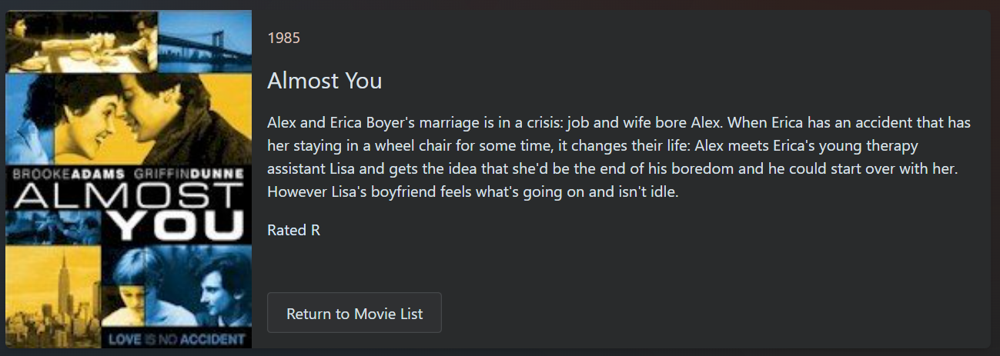
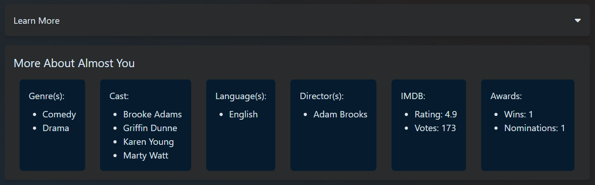
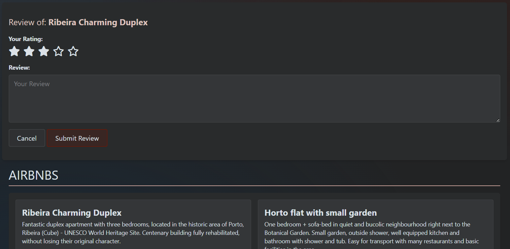
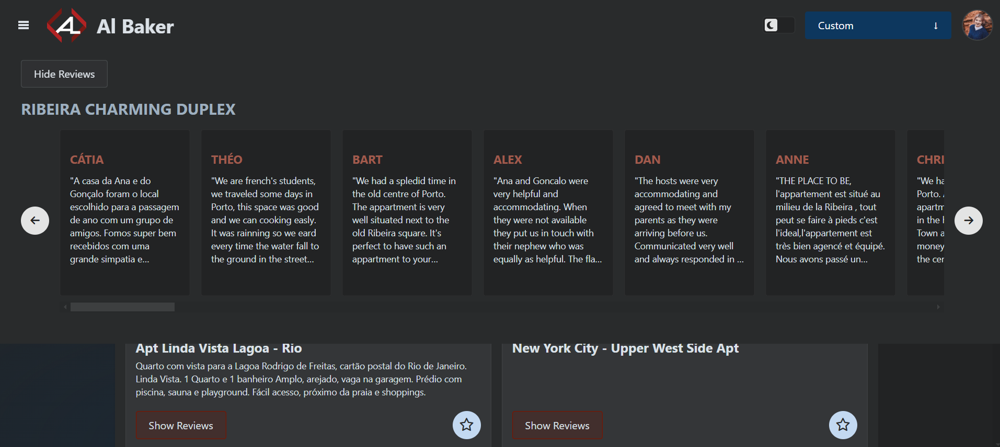
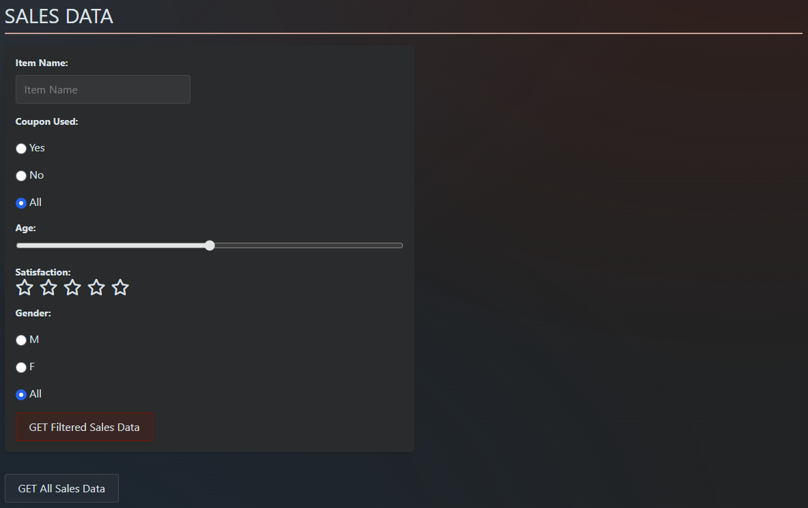
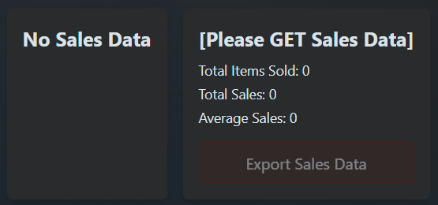
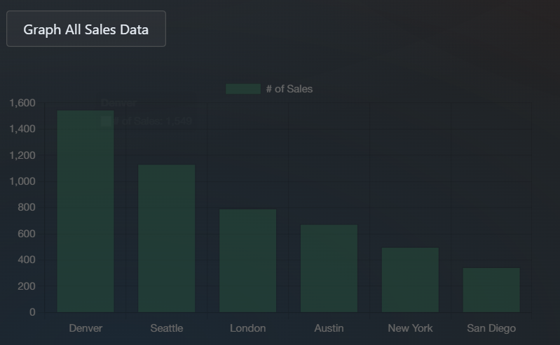
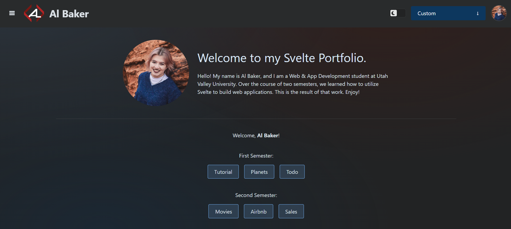
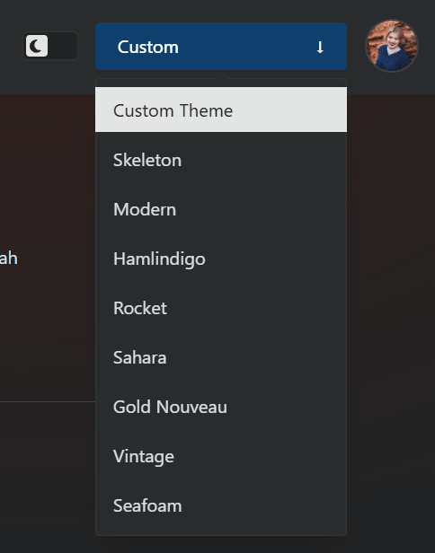
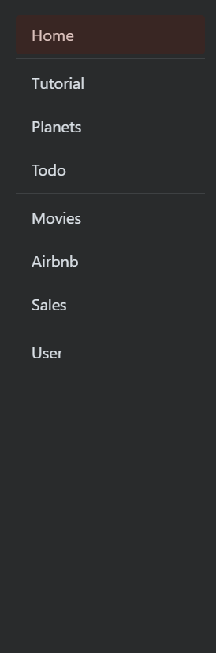

# Welcome to my SvelteKit Project!

My name is Al Baker, and I'm a Web & App Development student at Utah Valley University. Over the course of two semesters, I've created this app using Skeleton, Tailwind, Svelte, and MongoDB.

## MongoDB and AuthJS

Sign in to [my website](https://svelte.almariebaker.com/).

This is the code used to create a MongoDB clientPromise to use throughout the project to connect to MongoDB:

```typescript
import { MongoClient, ServerApiVersion } from 'mongodb';

if (!process.env.MONGODB_URI) {
	throw new Error('Invalid/Missing env variable: "MONGODB_URI"');
}

const uri = process.env.MONGODB_URI;
let clientPromise: Promise<MongoClient> | undefined;

// Create a MongoClient with a MongoClientOptions
// object to set the Stable API Version
try {
	const client = new MongoClient(uri, {
		serverApi: {
			version: ServerApiVersion.v1,
			strict: true,
			deprecationErrors: true
		}
	});
	clientPromise = client.connect().catch((e) => {
		console.error('Failed to connect to MongoDB', e);
		throw e;
	});
} catch (err) {
	console.error(err);
}

// Create a client promise that will resolve to the MongoDB
// client whenever other parts of our code ask for it
export default clientPromise;
```

## Master/Detail Routing

View the movie master/detail routing on the [Movies page](https://svelte.almariebaker.com/movies).

Clicking on a movie on the movies page takes you to the detail page for that movie, with cards that show information about it.



Below the movie card is a drop down that displays more information from the movie database about that movie.



## Adding a Form Action

View the form action on the [Airbnb page](https://svelte.almariebaker.com/airbnb).

Click the star icon on a review to display the form to leave a review.



Click the show reviews button to show all the reviews for that location in a slider across the top of the page.



## Adding API Endpoints

Make calls to the Sales API on the [Sales page](https://svelte.almariebaker.com/sales).

I created an API endpoint in my app that makes requests to the sample_supplies collection of my MongoDB database. I outlined my own GET and POST functions in a +server.ts file. Here is an example of one of those functions:

```typescript
export async function POST({ request }) {
	const reqBody = await request.json();

	let client;
	try {
		client = await clientPromise;
		const database = client?.db('sample_supplies');
		const collection = database?.collection('stats');
		collection?.insertOne(reqBody);
	} catch (error) {
		console.error('Failed to connect to MongoDB', error);
		if (client) {
			await client?.close();
		}
		return new Response(
			JSON.stringify('Failed to connect to MongoDB'),
			{ status: 500 }
		);
	}

	return new Response(JSON.stringify('Success!'), { status: 200 });
}
```

The form at the top of the page allows you to filter GET requests to the sales collection by a variety of properties.



The page prompts you to either make a filtered call or GET all data to be able to view anything.



After getting data from the database, you can graph it using Chart.js.



## Route Blocking

All routes except the Tutorials route are blocked unless you sign in using GitHub OAuth. The navigation has fewer buttons and will prompt you to sign in. Attempting to visit any other page by typing in the url directly will just redirect you to the home page to sign in.

In order to block a route, create a +page.server.ts file in the directory and add this to it:

```typescript
import { redirect } from '@sveltejs/kit';

export async function load(event) {
	const session = await event.locals.auth();
	if (!session?.user) {
		throw redirect(303, '/');
	}
}
```

This is the how the home page looks after you sign in.



## Code from Fall 2023 Semester

The Tutorials, Planets, and Todo routes are from the Fall 2023 semester. View that original project [here](https://starter-svelte-lake.vercel.app/).

## Other Features

There is a theme switcher in the top right hand corner, as well as a light/dark theme switch. Clicking on the profile picture prompts you to sign out. Clicking on the logo/brand name will take you to the home page.



There is a side menu for navigation between routes.


